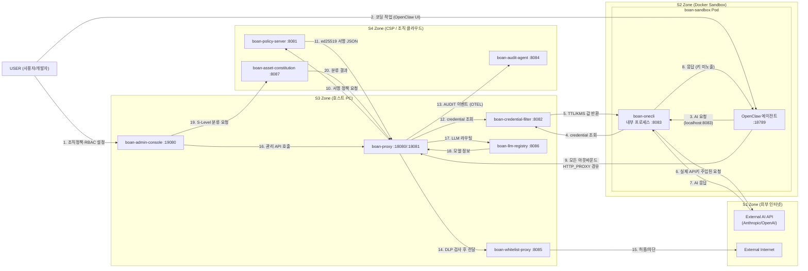
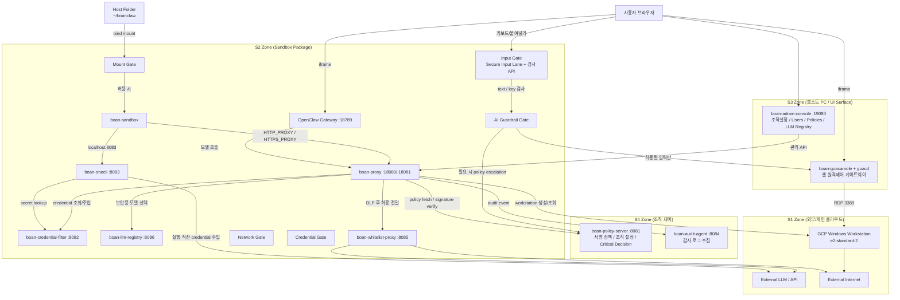
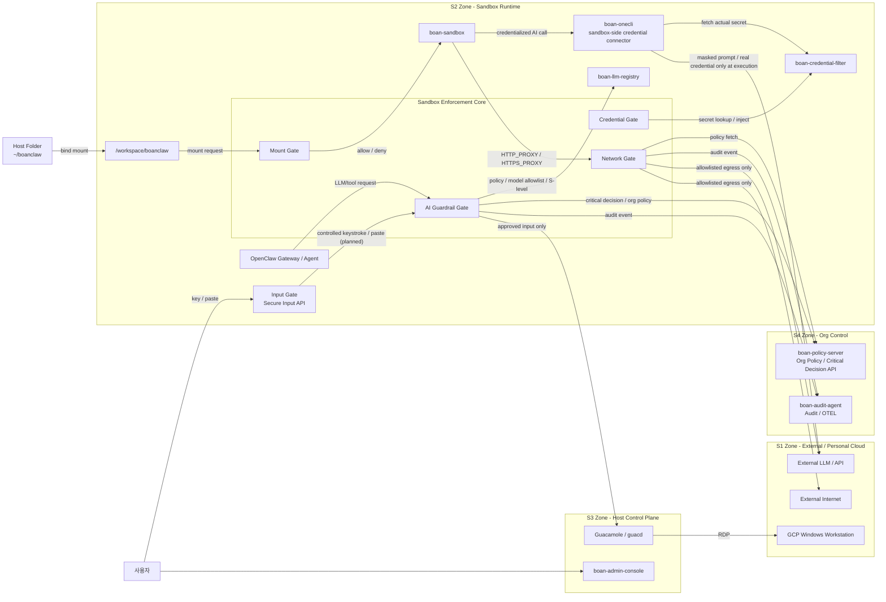

# BoanClaw 구성도

버전: v5.0 · 2026.03 · Samsung GenAI Security

---

## 1. S-Level 등급 체계

인프라와 데이터를 **동일한 등급 체계**로 관리한다. 숫자가 높을수록 보안 통제 수준이 높다(S4 최고 · S1 최저).

| 등급 | 인프라 | 데이터 성격 | LLM 정책 |
|------|--------|-------------|----------|
| **S4** | 조직 CSP(Org Policy / KMS / DB) | 기밀 · 절대 유출 불가, 조직 핵심 자산 | — |
| **S3** | 내 호스트 PC(Workspace / 로컬 파일) | 민감 · 조직 내부까지, 개인 식별·시스템 정보 | **사내 Security LLM 전용**(외부 LLM 없음) |
| **S2** | 내 호스트 안 Docker(에이전트 실행 환경) | 일반 업무, 비식별화 후 외부 가능 | **Security LLM 기본**, 외부 LLM은 **커넥터** 형태 |
| **S1** | 개인 클라우드(SkyClaw · 봇 통제 서버 등) | 공개 · 자유 이동 | **외부 LLM 자유**, 모니터링 없음(게이트 통과 후) |

**데이터·인프라 일치 규칙:** 데이터 Sn은 **인프라 Sn 이상**에서만 존재·이동 가능하다.

**정보 흐름 방향 규칙**

- **등급이 낮아지는 방향(내부 → 외부, 예: S4→S1):** 반드시 **게이트**를 통과해야 한다.
- **등급이 높아지는 방향(외부 → 내부, 예: S1→S4):** 상대적으로 **자유**롭게 설계할 수 있다(조직 정책에 따름).

---

## 2. 전체 구성도 (정보 흐름)

아래 다이어그램은 서비스 간 주요 정보 흐름과 S-Level 존을 나타낸다. **boan-onecli**는 S3가 아니라 **S2의 boan-sandbox Pod 내부 프로세스**로 배치한다.



**노드·서비스 요약**

| 노드 ID | 설명 |
|---------|------|
| USER | 사용자/개발자(브라우저·CLI) |
| ADMIN_CONSOLE | boan-admin-console (:19080) |
| SANDBOX | boan-sandbox / OpenClaw (:18789) |
| ONECLI | boan-onecli — S2 Pod **내부** (:8083) |
| BOAN_PROXY | boan-proxy (:18080 트래픽 / :18081 관리) |
| POLICY_SERVER | boan-policy-server (:8081) |
| CRED_FILTER | boan-credential-filter (:8082) |
| WHITELIST_PROXY | boan-whitelist-proxy (:8085) |
| LLM_REGISTRY | boan-llm-registry (:8086) |
| ASSET_CONSTITUTION | boan-asset-constitution (:8087) |
| AUDIT_AGENT | boan-audit-agent (:8084) |
| EXT_AI | 외부 AI API(Anthropic / OpenAI 등) |
| EXT_NET | 외부 인터넷 |

---

## 2-1. 현재 구현 기준 구성도 (As-Built)

아래 다이어그램은 **현재 로컬 docker-compose 및 GCP 워크스테이션 기준으로 실제 동작하는 흐름**을 다시 그린 것이다.  
기존 v5 철학을 유지하되, 실제 구현된 컴포넌트(`Guacamole`, `GCP Windows Workstation`, `OpenClaw Gateway`, `boan-proxy` fail-closed whitelist)를 중심으로 표현한다.



### 현재 구현 해석

- **S4 ↔ S2**
  - `boan-policy-server`가 조직 정책과 서명 정책 본문을 제공
  - sandbox package 내부의 `boan-proxy` / `AI Guardrail Gate`가 이를 fetch하여 화이트리스트, 모델 정책, 입력 정책을 반영

- **S3 ↔ S2**
  - `boan-admin-console`은 UI 셸
  - enforcement core(`boan-proxy`, `credential-filter`, `llm-registry`, `whitelist-proxy`, `onecli`)는 sandbox package 안에 포함
  - 즉 S3는 점점 얇은 control surface만 남기고, 실행·집행은 S2에 수렴

- **S2 ↔ S1**
  - 외부로 나가는 HTTP 계열 요청은 sandbox 내부 `boan-proxy` / `Network Gate` allowlist를 통과해야 함
  - 현재 raw `CONNECT` HTTPS 터널은 **fail-closed**로 차단
  - 즉 정책에 없는 외부 목적지는 기본 차단

- **작업 컴퓨터 경로**
  - 소유자 승인 후 sandbox 내부 `boan-proxy`가 GCP Windows VM 생성/조회
  - 원격 화면은 `Guacamole`이 RDP로 붙고, 브라우저는 `boan-admin-console`의 `/remote/` reverse proxy를 통해 같은 창에서 봄
  - 키보드/붙여넣기는 이제 `Input Gate`가 먼저 받아 검사 후 전달하는 구조로 바뀌기 시작함

---

## 2-2. 정보 흐름 기준 포함 구조 (Gates Included)

아래 다이어그램은 **어떤 게이트가 어느 존에 포함되는지**와 **정보가 어떤 선을 따라 이동하는지**를 중심으로 다시 그린 것이다.

핵심은 다음과 같다.

- `Credential Gate`, `AI Guardrail Gate`, `Network Gate`, `Mount Gate`의 **주 집행 위치는 이제 S2 sandbox package 내부**
- `boan-onecli`는 **S2 sandbox 내부**에서 실행되며, **Credential Gate의 sandbox-side connector** 역할을 한다
- `Input Gate`는 **브라우저에서 키입력을 선점**하지만, 실제 판단과 집행 API는 **S2 sandbox 내부 gate**를 탄다



### 포함 구조 해석

| 게이트 | 포함 위치 | 설명 |
|--------|-----------|------|
| Mount Gate | **S2 / sandbox enforcement core** | 호스트 폴더가 S2 sandbox runtime으로 들어갈 수 있는지 결정 |
| Credential Gate | **S2 / sandbox enforcement core + credential-filter** | secret은 사람이 읽거나 LLM이 읽는 형태로 존재하면 안 되며, placeholder만 보이고 실행 직전에만 실제 값이 주입된다 |
| AI Guardrail Gate | **S2 / sandbox enforcement core** | 프롬프트/응답/행동/입력에 대한 정책 검사 |
| Network Gate | **S2 / sandbox enforcement core** | S2→S1 네트워크 egress 화이트리스트 집행 |
| Input Gate | **UI capture + S2 enforcement API** | 원격 입력을 먼저 가로채고 검사 후 S1에 전달 |
| onecli | **S2 / sandbox 내부** | sandbox 안에서 credentialized upstream call을 연결하는 커넥터 |

### 정보 흐름 요약

1. **S3 → S2 (마운트)**
   - `~/boanclaw` → `Mount Gate` → `/workspace/boanclaw`
   - 정책에 정의된 `mount_root` 밖은 차단

2. **S2 → S1 (AI 호출)**
   - `OpenClaw / tool request` → `AI Guardrail Gate`
   - 필요 시 `Credential Gate`로 secret lookup
   - 애매하거나 위험하면 `S4 policy-server`에 critical decision 요청
   - 허용된 요청만 S1 LLM/API로 전달

3. **S2 → S1 (일반 네트워크)**
   - `sandbox outbound` → `Network Gate`
   - allowlist host/port/method만 통과

4. **S2 → S1 (원격 입력, Input Gate MVP)**
   - 브라우저가 `키보드/붙여넣기`를 먼저 선점
   - `Input Gate API`가 S2 sandbox 내부에서 검사
   - `AI Guardrail Gate` / credential-like rule 통과 후
   - 허용된 텍스트/키만 `Guacamole`을 통해 GCP VM에 주입

5. **Credential Gate (비밀정보 readable-surface 제거)**
   - `Credential Gate`는 S-Level 게이트가 아니라 **비밀정보 readable-surface 제거 장치**다
   - secret은 **사람이 읽는 경로** 또는 **LLM 프롬프트에 들어가는 경로**에 raw 값으로 존재하면 안 된다
   - 따라서 `S3 UI / 클립보드 / 로그 / 입력창`과 `S2 내부 LLM 프롬프트`는 모두 `Credential Gate` 대상이 될 수 있다
   - 허용되는 형태는 placeholder뿐이다. 예: `{{CREDENTIAL:prod_api_key}}`
   - 실제 secret은 `onecli`가 **실행 직전** HTTP header / env injection / provider auth로만 주입한다
   - 실행 후 사람에게 보여지는 결과에도 raw secret이 남으면 안 되며, 결과 역시 placeholder 기준으로 다시 마스킹된다

### 정보 흐름과 감시장치

감시의 의미는 단순 로깅이 아니라, **높은 레벨에서 낮은 레벨로 정보가 흐를 때 반드시 붙어야 하는 통제 장치**를 뜻한다.  
즉 `Critical Guardrail`은 여러 장치 중 하나이며, 모든 하향 흐름이 반드시 `Critical Guardrail`을 타는 것은 아니다.

| 번호 | 정보의 가능한 흐름 | src level | dest level | 감시 필요 여부 | 필요 시 어떤 감시/장치 |
|------|--------------------|-----------|------------|----------------|-------------------------|
| 1 | `S4 정책 서버 → S3 호스트 UI/컨트롤 플레인` | 4 | 3 | 아니오 | 정책 배포, 서명 검증, audit |
| 2 | `S3 호스트 폴더 → S2 sandbox workspace` | 3 | 2 | 예 | `Mount Gate` + 인간 승인 mount |
| 3 | `S2 sandbox → S3 Security LLM` | 2 | 3 | 아니오 | 일반 routing / audit만, `Critical Guardrail` 불필요 |
| 4 | `S2 sandbox → S1 외부 LLM API` | 2 | 1 | 예 | `Network Gate` + 필요 시 `Critical Guardrail` |
| 5 | `S2 sandbox → S1 일반 외부 API / 인터넷` | 2 | 1 | 예 | `Network Gate` + 필요 시 `Critical Guardrail` |
| 6 | `S2 sandbox → S1 개인 Windows 작업컴퓨터 입력` | 2 | 1 | 예 | `Input Gate` + 필요 시 `Critical Guardrail` |
| 7 | `S3 로컬 입력 버퍼 → S1 Windows 붙여넣기` | 3 | 1 | 예 | `Input Gate` + `Critical Guardrail` |
| 8 | `S3 로컬 클립보드 → S1 Windows paste` | 3 | 1 | 예 | `Input Gate` + `Critical Guardrail` |
| 9 | `S1 Windows 내부 복사 → S3 로컬 클립보드` | 1 | 3 | 아니오 | clipboard sync, 필요 시 audit만 |
| 10 | `S2 실행 계획/코드 → 실행 직전 credential 주입` | 2 | 2 또는 1 직전 | 예 | `Credential Gate` |
| 11 | `S3 UI / 클립보드 / 로그 / 입력창 → 사람이 읽을 수 있는 raw secret` | 3 | 3 | 예 | `Credential Gate` |
| 12 | `S2 내부 LLM prompt → raw secret 포함` | 2 | 2 | 예 | `Credential Gate` |
| 13 | `S2 sandbox → S2 내부 서비스(proxy / registry / filter)` | 2 | 2 | 아니오 | 내부 policy / audit만 |
| 14 | `S3 UI → S4 approvals / policy 수정` | 3 | 4 | 아니오 | 인증, 권한검사, audit |

#### 해석 원칙

1. `dest_level < src_level` 이면 **하향 정보 흐름**이다.
2. 하향 정보 흐름이면 반드시 **적절한 감시장치**가 있어야 한다.
3. 감시장치는 경로마다 다르다.
   - `S3 → S2` : `Mount Gate`
   - `S2 → S1 외부 API` : `Network Gate` + 필요 시 `Critical Guardrail`
   - `S3/LV3 → S1 입력/클립보드` : `Input Gate` + `Critical Guardrail`
   - `실행 직전 secret 사용` : `Credential Gate`
4. `S2 → S3 Security LLM`처럼 **상향 흐름**은 `Critical Guardrail` 대상이 아니다.
5. `Credential Gate`는 별도 축이다.
   - 적용 조건: **사람이 읽을 수 있는 경로** 또는 **LLM이 읽을 수 있는 경로**에 raw secret이 나타나는가
   - 즉 `Credential Gate`는 `Critical Guardrail`처럼 하향 흐름 전용이 아니라, readable surface 제거 장치다.

---

## 3. 3개 게이트 상세

### S4 ↔ S3 게이트 (시스템적 제어)

- **신뢰 주체:** 시스템(기계) — 수학적·암호학적 보장, 사람 개입 최소.
- **KMS(Key Management Service):** Credential TTL 기반 자동 순환, CMEK(고객 관리 암호화 키), 만료 시 자동 재발급 후 S3 호스트에 전달.
- **정책 서명:** Org Policy Server가 **ed25519**(필요 시 HSM)로 서명한 정책만 신뢰. S3의 boan-proxy 등이 공개키로 검증 후 적용. **서명 실패 시** 정책 미적용 + 관리자 알림.
- **Credential:** 자동 발급·TTL 만료 관리, 메모리 전용 주입 등으로 평문 장기 보관 회피.
- **감사:** OTEL 등으로 S4 Logging과 연동(tamper-proof 로그 설계와 조합).

**Credential TTL 상태 코드**

| 코드 | 의미·동작 |
|------|-----------|
| `ok` | 정상 진행 |
| `missing` | 자격 증명 없음 → 에이전트 기동 차단(fail-closed), OTEL 알림(문서상 `missing_credential`과 동일 의미) |
| `invalid_expires` | 만료·설정 오류 → 기동 차단, 관리자 알림 |
| `expired` | 만료됨 → 자동 재발급 시도, 실패 시 차단 + 알림 |
| `unresolved_ref` | 참조 해석 실패 → 기동 차단, 설정 오류 로그 |

### S3 ↔ S2 게이트 (인간 검수)

- **신뢰 주체:** 개발자 본인 — 능동적·의식적 선택, 책임 귀속이 명확하다.
- **진입 방식:** Workspace를 Docker에 넣는 것은 **암묵적 자동 확장이 아니라**, 개발자가 **`boanclaw mount`** 등으로 명시적으로 허용한 경계를 통해서만 이루어진다.  
  예: `boanclaw mount /workspace/project` → S2 진입 허용.
- **S4 데이터 경고:** 마운트 대상에 S4급 데이터가 포함된 것으로 감지되면 경고(“S4 데이터가 포함되어 있습니다. 계속하시겠습니까?” 등). 강제 진행 시 **감사 로그**에 남긴다.
- **boan-proxy 보조:** 마운트 시점에 대상 디렉터리의 데이터 S-Level **사전 스캔**을 수행할 수 있다(설계 문서 기준).
- **원칙:** 인간이 선택한 것은 인간의 책임. 시스템은 경고·차단으로 돕되 최종 결정은 개발자 정책에 따른다.

### S2 ↔ S1 게이트 (조직 자동 집행 — boan-proxy)

- **신뢰 주체:** 조직(정책 서버) — 개인 판단이 아닌 **규칙 자동 집행**.
- **역할:** S2(샌드박스)에서 S1(외부 인터넷·클라우드)로 나가는 트래픽을 **중앙에서 검사·허용/차단**한다. DLP·네트워크·SSRF·프롬프트 관련 정책이 이 경계에서 적용된다.
- **처리 흐름(요약 7단계, S2→S1 아웃바운드 기준):**
  1. **RBAC / Identity** — 미인증 시 fail-closed.
  2. **TLS 인터셉터** — HTTPS 검사(MITM · 자체 CA · 검사 후 재암호화).
  3. **Network Policy Gate** — Egress Whitelist, 미등록 목적지 차단(fail-closed). S4/S3 데이터 판정 시 외부 egress 강제 차단 등 정책 반영.
  4. **DLP** — Rule Detector(~0ms) + Local LLM Detector(~1–2s) 결합, 데이터 S-Level 판정(S4·S3 → 차단, S2 → 비식별화 후 통과, S1 → 통과).
  5. **Credential 주입** — API Key 등 동적 삽입, **메모리 전용**(디스크 저장 금지).
  6. **재암호화·전달** — 검사 완료 후 S1 목적지로 전달.
  7. **Audit(및 역방향 검사)** — S1→S2 응답에 대한 역방향 DLP 스캔, **OTEL → S4 Logging** 등 감사 기록.

**인바운드(S1→S2):** 응답 수신은 원칙적으로 차단하지 않되, 역방향 DLP로 이상 페이로드 탐지.

동일한 **Credential TTL 상태 코드** 표가 S4↔S3 경계의 자격 증명 수명 관리에도 적용된다(위 표 참조).

---

## 4. 듀얼 에이전트 라우팅

**개념:** S2 Docker 안 **보안용 비서**(OpenClaw 로컬)와 S1 클라우드 **실용성 비서**(SkyClaw 등)를 동시에 두고, **boan-proxy**가 S2↔S1 게이트에서 **DLP 판정과 라우팅**을 담당한다.

**라우팅 결정(요약)**

```
사용자 요청
     │
boan-proxy (DLP 판정 + 라우팅)
     │
     ├── S4·S3 데이터 포함 감지
     │       → 보안용 비서 (S2 Docker · OpenClaw 로컬)
     │         사내 LLM 전용 · 외부 LLM은 커넥터만
     │
     └── S1·S2 데이터만
             → 실용성 비서 (S1 클라우드)
               외부 LLM 자유 · S1 진입 후 통제 없음(설계 의도)
```

**보안용 비서(S2) vs 실용성 비서(S1)**

| 항목 | 보안용 비서 (S2) | 실용성 비서 (S1) |
|------|------------------|------------------|
| 실행 위치 | 내 Docker 안 | 클라우드 |
| 데이터 통제 | boan-proxy 상시 적용 | S1 진입 후 통제 없음 |
| LLM | 사내 Security LLM 권장, 외부는 커넥터 | 클라우드 LLM 자유 선택 |
| 속도 | 상대적으로 느림 | 빠름 |
| 적합 작업 | 기밀 코드, 내부 문서, Credential | 일반 코딩, 리서치, 공개 API |
| DLP 오버헤드 | 있음 | 없음(이미 게이트 통과) |

**핵심 원칙:** S1으로 보내기로 결정된 시점에 “이 데이터는 S1 레벨”이라는 **판정이 끝난 것**으로 본다. S1 내부에서 추가 통제를 하지 않는 것은 **중복 통제 회피**를 위한 의도된 설계다.

**CLI 예시**

```bash
boanclaw chat "코드 리뷰해줘"           # 자동 라우팅
boanclaw chat --secure "계약서 분석"    # S2 보안용 강제
boanclaw chat --cloud "파이썬 튜토리얼"  # S1 실용성 강제
```

---

## 5. S-Level별 LLM 거버넌스

| 존 | LLM 정책 |
|----|----------|
| **S3 (호스트 직접 실행)** | **Security LLM 전용.** Claude Code 스타일로 내 PC 소스 전체 접근 가능하나 **외부 LLM 없음** — 가장 강한 기밀 보호. |
| **S2 (Docker · 보안용 비서)** | **Security LLM 기본.** 외부 LLM이 필요하면: 에이전트 → Security LLM(1차) → 필요 시 DLP 비식별화 → External LLM(커넥터, **boan-llm-registry** 등록). 직접 외부 호출이 아니라 Security LLM이 중재. |
| **S1 (클라우드 · 실용성 비서)** | **External LLM 자유**, 모니터링 없음. 다만 **S2→S1 게이트(boan-proxy)**는 계속 동작하며, S1에 도달한 데이터는 이미 S1 레벨로 판정된 것으로 본다. |

**요약 원칙:** S3는 완전 내부, S2는 외부 LLM을 **커넥터**로만, S1은 **자유**이되 게이트 통과 데이터만 도달.

---

## 6. boan-proxy 내부 구조

- **역할:** S2에서 S1으로 나가는 트래픽 검사, Org Policy 수신·자동 집행, **서비스 종류와 무관**하게 HTTP 계층에서 동일 적용.
- **배포 형태:** 경량 **단일 Docker 컨테이너**(문서상 S2↔S1 게이트 + 라우터).
- **포트:** `18080` — HTTP/HTTPS 프록시 트래픽 · `18081` — 관리 API·헬스.
- **리소스:** 메모리 최대 **512MB**, CPU **0.5 core** 상시, 판정 시 burst.

**S2→S1 아웃바운드 처리 순서(상세)**

1. **Identity / RBAC** — Tool·역할 단위 `auth_policy` 메타데이터(예: read_file → any_authenticated, exec_cmd → admin_only). 미인증 → fail-closed.
2. **TLS 인터셉터** — MITM · 자체 CA · 검사 후 재암호화.
3. **Network Policy Gate** — Egress Whitelist, fail-closed.
4. **DLP 3단계 분류 + 이중 탐지** — Rule Detector(API Key, DB URL, PEM, 전화·주민번호 패턴 등) + Local LLM(급여·계약·의료·기밀 키워드 문맥). Critical Asset 룰과 결합해 S-Level 판정.  
   - S4·S3 데이터 → 보안용 비서 경로 + 외부 차단  
   - S2 데이터 → PII 마스킹 후 보안용 비서 또는 실용성 비서  
   - S1 데이터만 → 실용성 비서(S1 클라우드)
5. **Credential 주입** — 메모리 전용, 디스크 저장 금지.
6. **재암호화·전달** — whitelist-proxy 등 후속 단계로 전달 후 S1 목적지로 송신.
7. **역방향 검사 + Audit** — 응답 스캔, Rate Limit, **OTEL → S4 Logging**.

**트래픽 유도(참고)**

- **방법 A(권장):** `export HTTPS_PROXY=http://localhost:18080` — 클라이언트가 자동 통과.
- **방법 B(강제):** iptables 투명 프록시 — 환경변수를 무시하는 앱도 강제 통과.

---

## 7. 보안 통제 요약

| 위치 | 보안 통제 | 방어하는 공격 |
|------|-----------|---------------|
| **boan-proxy** | Rate limit, Prompt guard, DLP, SSRF 방어, ed25519 **서명 정책** 검증, mTLS, RBAC, 타이밍 안전 비교 | 무차별 대입·남용, 프롬프트 인젝션/탈옥, 민감 데이터 유출, SSRF·내부망 스캔, 정책 변조, 인증·권한 우회, 타이밍 기반 정책/비밀 추측 |
| **boan-sandbox** | 환경 변수·시크릿 **sanitize**, **mount** 허용 목록, **seccomp** 등 컨테이너 하드닝, **git-guard** | 샌드박스 내 시크릿·토큰 노출, 호스트 경로 임의 마운트, 시스템 콜 악용, 위험한 원격·로컬 git 동작 |
| **boan-onecli** | **Credential isolation**(실키 미노출), **model rewrite**·라우팅 정책, Rate limit | API 키 유출, 허용되지 않은 모델·엔드포인트 사용, 게이트웨이 남용 |
| **boan-credential-filter** | **KMS** 암호화 저장, **TTL**, **auto-renew** | 자격 증명 정적 유출, 장기 유효 토큰 탈취, 만료·회전 미흡으로 인한 지속 침해 |

---

## 8. 포트 맵

| 서비스 | 포트 | 프로토콜 | 역할 |
|--------|------|----------|------|
| boan-admin-console | 19080 | HTTP | 조직 설정·RBAC·감사·LLM 등록 UI |
| boan-sandbox (OpenClaw Gateway) | 18789 | HTTP | S2 샌드박스 내 OpenClaw UI |
| boan-onecli | 8083 | HTTP | OpenAI 호환 AI 게이트웨이(S2 Pod 내부, 에이전트 연결점) |
| boan-proxy (트래픽) | 18080 | HTTP/HTTPS | 샌드박스 아웃바운드 프록시 |
| boan-proxy (관리) | 18081 | HTTP | 헬스·감사·정책 상태 등 관리 API |
| boan-policy-server | 8081 | HTTP | 서명 정책 배포 |
| boan-credential-filter | 8082 | HTTP | 자격 증명 조회·KMS·TTL |
| boan-whitelist-proxy | 8085 | HTTP/HTTPS | DLP 이후 허용 목록 기반 아웃바운드 |
| boan-llm-registry | 8086 | HTTP | LLM·모델 메타데이터·S2/S1 라우팅 정보 |
| boan-asset-constitution | 8087 | HTTP | 자산 S-Level 분류 |
| boan-audit-agent | 8084 | HTTP/gRPC(OTEL) | 감사·텔레메트리 수집 |
| External AI API | 공급사 표준(예: 443) | HTTPS | Anthropic / OpenAI 등 외부 LLM |
| External Internet | 대상별 | HTTP/HTTPS | 일반 웹·API |

---

## 9. 접속 URL (개발환경)

| 페이지 | URL | 설명 |
|--------|-----|------|
| 조직설정 페이지 (Admin Console) | http://localhost:19080 | 조직 정책, RBAC, LLM 등록, 감사로그, Exec 승인 |
| S2 내부 OpenClaw 페이지 | http://localhost:18789 | Sandbox 내부 OpenClaw Gateway UI |
| boan-proxy 관리 API | http://localhost:18081 | 프록시 헬스, 감사, 정책 상태 |
| boan-onecli AI Gateway | http://localhost:8083 | OpenAI-compatible endpoint(에이전트 연결점; 포트 포워딩 시) |

모바일 앱은 **boan-admin-console**과 동일한 URL(`http://localhost:19080`)을 사용하며, 반응형 UI로 동일한 관리 기능에 접근한다.

---

## 10. 컴포넌트 명칭 정리

**S4 (조직 CSP)**

| 명칭 | 설명 |
|------|------|
| boan-policy-server / boan-policy-distributor | 정책 배포(ed25519 서명), 전 직원 boan-proxy 자동 배포 |
| boan-credential-filter | IAM Role→키 매핑, Credential TTL·상태 코드 |
| boan-asset-constitution | S-Level 분류 기준 원본(Image/Text/File 계층, AI 관리 사이클) |
| KMS | CMEK, TTL 키 순환, 자동 재발급 |
| Logging / boan-audit-agent | OTEL 수신, tamper-proof·보존·규정 리포트 |
| boan-channel-server | Browser/App REST API(IAM 검증) — 참조 아키텍처 |

**S3 / 호스트 PC**

| 명칭 | 설명 |
|------|------|
| boan-admin-console | 조직·RBAC·감사 UI |
| boan-proxy | S2↔S1 게이트 + 라우터(18080/18081) |
| boan-credential-filter | (배치에 따라 S4와 연동되는) 호스트 측 자격 증명 조회 지점 |
| boan-whitelist-proxy | DLP 이후 허용 목록 프록시 |
| boan-llm-registry | LLM 객체·scope 접근 제어 |
| Workspace | 코드·파일(분류 기준 원본은 S4 constitution) |
| DRM / MDM | 단말 정책(본 문서 범위 외) |

**S2 (Docker / 샌드박스)**

| 명칭 | 설명 |
|------|------|
| boan-sandbox Pod | OpenClaw 에이전트, Landlock+seccomp, boan-agent 등 |
| boan-onecli | Pod **내부** AI 게이트웨이(:8083), credential-filter 연동 |
| 보안용 비서 | OpenClaw 로컬 — 민감 코드·내부 문서·Credential 작업, 아웃바운드는 boan-proxy 경유 |
| boan-agent | LLM Tool Executor, 세션 체크포인트 등 |
| boan-git-guard | 파괴 명령 차단·자동 커밋 등 git 래퍼 |
| boan-policy-proxy | (k3s 참조 구성) TLS CA·mTLS·정책 집행 |
| boan-orchestrator | 컨테이너 생명주기·Watchdog(참조 구성) |

**S1 (개인 클라우드)**

| 명칭 | 설명 |
|------|------|
| 실용성 비서 | SkyClaw / OpenClaw Cloud / 미래 AI 서비스 X — 일반 코딩·리서치, 외부 LLM 자유 |

---

## 11. 컨테이너 탈출 피해 범위 원칙

| 구분 | 내용 |
|------|------|
| 탈출 시 **획득 가능** | 현재 세션 API Key(**TTL 내**, **메모리 한정**) |
| 탈출 시 **불가** | 다른 세션 키, Org Policy Server, KMS, Credential Vault(설계 목표) |

**보장 수단(원칙):** Credential 환경변수 전용 주입(파일 미생성), 세션 종료 시 env 명시적 삭제(unset·secure wipe), k3s **NetworkPolicy default-deny**, PID namespace 격리, **Docker socket 마운트 금지**.

---

## 12. 서비스 무관 동작 원리

- boan-proxy가 보는 것: **HTTP 메서드 + URL + 요청 바디**(프롬프트·파일 내용).
- boan-proxy가 알 필요 없는 것: **어떤 AI 서비스인지** — 동일한 게이트로 처리한다.

**새 서비스 추가 시:** Org Policy Server에서 해당 도메인을 **S1 Whitelist**에 등록하면 된다. **boan-proxy 코드 변경 없음.**

예: 2026 SkyClaw.com 등록 → 즉시 사용, 2027 새 서비스 Y.ai → 동일, 2028 규제 변경 → DLP 룰만 업데이트하면 전 직원에 자동 적용.

---

## 13. 조직 규모별 적용

| 규모 | 적용 방식 |
|------|-----------|
| **대기업**(온프레미스 + CSP 병행) | S4 = 온프레미스 + 조직 CSP(둘 다 S4). S4↔S3 = **VPN + KMS** 등. |
| **중소기업**(온프레미스 없음) | S4 = 조직 관리 CSP(AWS/GCP/Azure + CMEK). VPN·조직 CSP IAM으로 S4↔S3. 온프레미스 없이도 동일 체계. |
| **개인 개발자** | S4 생략 가능. S3 = 내 PC. **S3↔S1 게이트 = boan-proxy** 위주로 단순화. |

---

## 부록: boanclaw security audit (자가 진단 CLI)

```bash
boanclaw security audit          # 기본 탐지
boanclaw security audit --deep  # 심층 검증
boanclaw security audit --fix    # 자동 수정
boanclaw security audit --json   # 기계 판독 출력
```

**탐지 심각도 예시:** [CRITICAL] boan-proxy fail-closed, Docker socket 마운트, S4·S3→외부 차단 검증 · [HIGH] Credential 메모리 전용, Landlock, TLS 만료(30일 이내 경고), Credential 상태 코드 · [MEDIUM] Org Policy 연결·서명, NetworkPolicy, llm-registry scope · [LOW] Rate limit, OTEL export.

---

*본 문서는 `02_전체시스템구성도.txt`, `05_범용보안플레인_설계.txt`, `architecture.md`를 통합·정렬한 구성도·아키텍처 참조본이다.*
